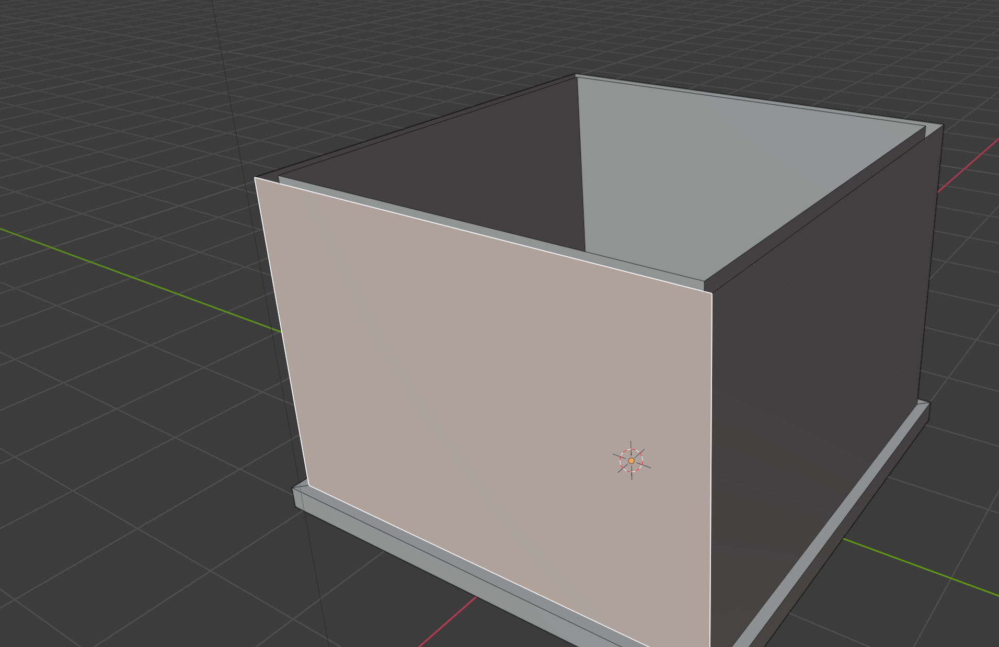
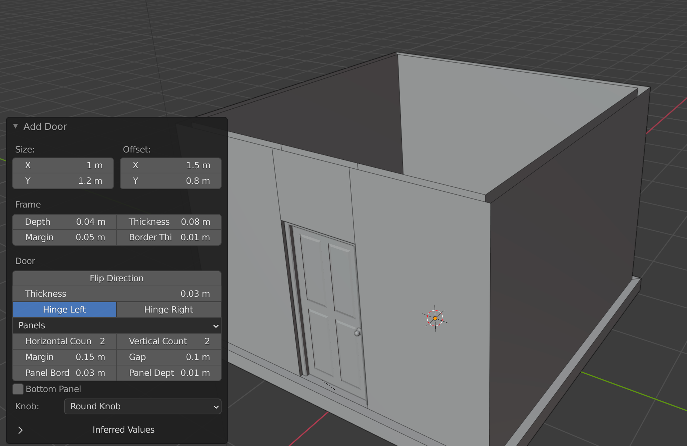
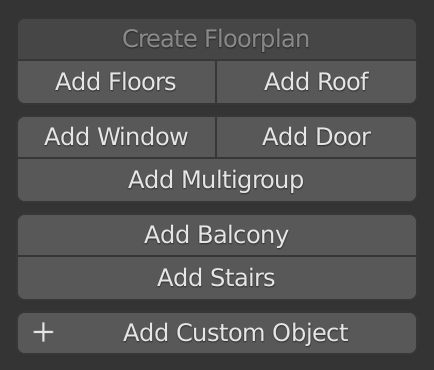

# Quick Arch

Created by [Lucky Kadam](https://twitter.com/luckykadam94).

Quick Arch is a blender add-on that provides one click solutions to your arch-viz needs. Just select the wall face and click the button “Add Door”. Poof, you have a door - no magical objects, just clean geometry.

And we have got whole range of such operators :)

# Demo

## Why Quick Arch?

* No learning curve - Approachable to beginner and advanced users alike.
* One-Click is all it takes - Add complex components (door, window, etc) in just one click. Click your way to a complete building from ground up.
* The way you like it - Each component comes with ample settings for extensive customization. Get greater control without compromising on speed.
* Mix it up - Adopt incrementally, use only when you need it. Compatible with other tools in your Blender 2.80+ workflow.

## Inspiration
Quick Arch is a fork of [building_tools](https://github.com/ranjian0/building_tools) with aim to add support for building interiors. Thank you [ranjian0](https://github.com/ranjian0) for this awesome project.
